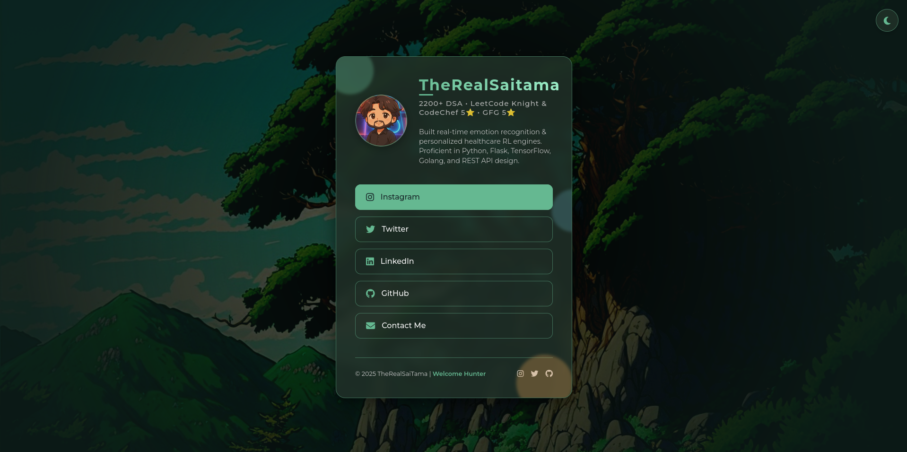

<!--
  *******************************************************
  *  🔥 TheRealSaiTama Linktree 🔥                        *
  *  A mind-blowing, mystical portal to your digital realm *
  *******************************************************
-->

<p align="center">
  
</p>

<h1 align="center">✨ TheRealSaiTama Linktree ✨</h1>

<p align="center">
  <a href="#features">Features</a> | 
  <a href="#tech-stack">Tech Stack</a> | 
  <a href="#live-demo">Live Demo</a> | 
  <a href="#getting-started">Get Started</a> | 
  <a href="#license">License</a>
</p>

<p align="center">
  <a href="https://img.shields.io/badge/React-19.0.0-blue?logo=react" target="_blank"></a>
  <a href="https://img.shields.io/badge/Vite-6.3.1-purple?logo=vite" target="_blank"></a>
  <a href="https://img.shields.io/badge/CSS-💚-green" target="_blank"></a>
  <a href="https://img.shields.io/badge/License-MIT-yellow.svg" target="_blank"></a>
</p>

---

## 🌟 Live Demo

👉 [https://your-deployment-url.com](https://your-deployment-url.com) <!-- replace with actual -->

---

## 🚀 Features

| 🌌 Mystical Design   | 💡 Dark & Light Mode | ⚡ Lightning Performance |
|----------------------|----------------------|--------------------------|
| Parallax particle effects that float like forest motes<br>immersive, ethereal atmosphere | Toggle seamlessly between luminous day and dreamy night themes | Vite + React deliver blazing-hot HMR and FPS-smooth UI |
| 🌀 Loading Magic      | 🎨 Interactive Links  | 📐 Responsive by Design  |
| Custom loading screen with pulsing sigil and progress bar<br>keeps users enchanted | Hover waves glow under each link<br>responsive touch feedback | Works flawlessly on mobile, tablet & desktop

---

## 💻 Tech Stack

<p align="center">
  
  
  
  
</p>

---

## 🛠️ Getting Started

1. **Clone this repo**
   ```bash
   git clone https://github.com/TheRealSaiTama/LinkTree.git
   cd LinkTree
   ```
2. **Install dependencies**
   ```bash
   npm install
   ```
3. **Launch in dev mode**
   ```bash
   npm run dev
   ```
4. **Open your browser** at `http://localhost:5173` and witness the magic.

---

## 📂 Project Structure

```bash
LinkTree/
├─ public/
│  ├─ favicon.ico
│  └─ me.png           # Your avatar
├─ src/
│  ├─ components/
│  │  ├─ LoadingScreen.jsx
│  │  └─ ThemeToggle.jsx
│  ├─ App.jsx          # Entry to the mystical portal
│  └─ index.css        # The styling spellbook
├─ index.html          # HTML template with data-theme magic
├─ package.json
├─ vite.config.js      # Vite incantations
└─ README.md           # You are here: the grimoire of knowledge
```

---

## 🎁 Contributing

1. Fork it (<https://github.com/TheRealSaiTama/LinkTree/fork>)
2. Create your feature branch (`git checkout -b feature/AmazingFeature`)
3. Commit your changes (`git commit -m 'feat: add amazing feature'`)
4. Push to the branch (`git push origin feature/AmazingFeature`)
5. Open a Pull Request

---

## ❤️ Support

If this project enchanted you, please ⭐️ this repo. Share the magic!

---

## 📄 License

Distributed under the MIT License. See [LICENSE](LICENSE) for more information.
